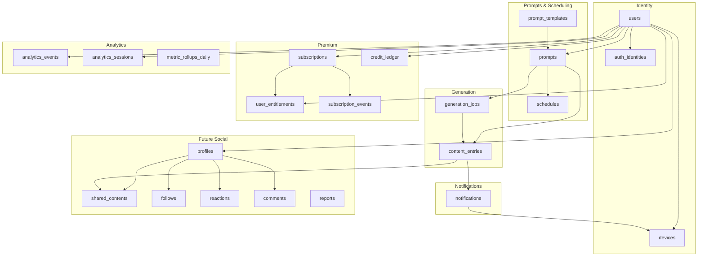
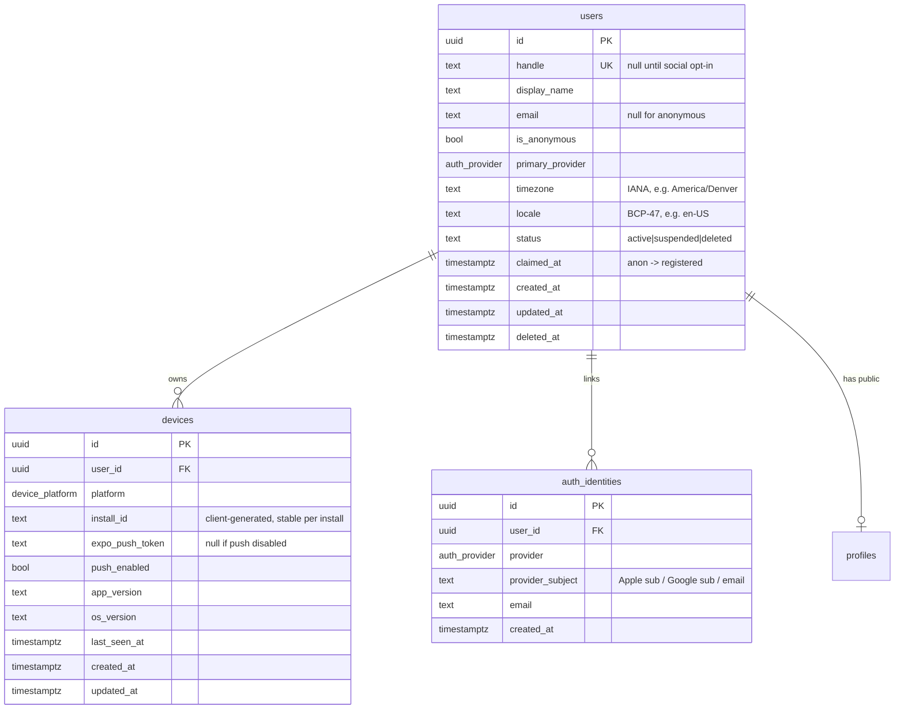
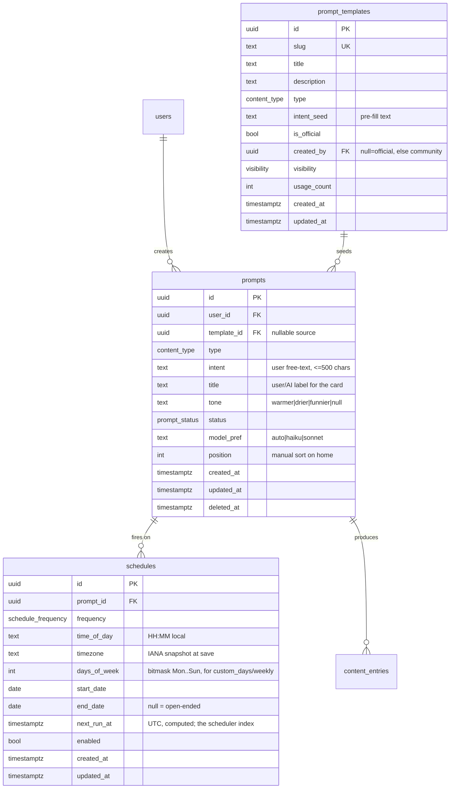
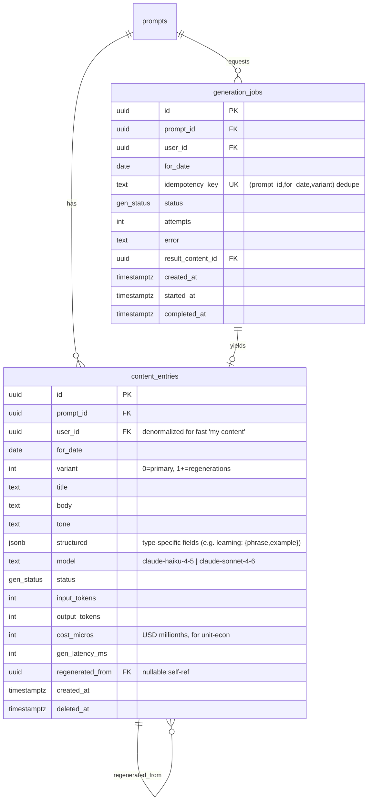
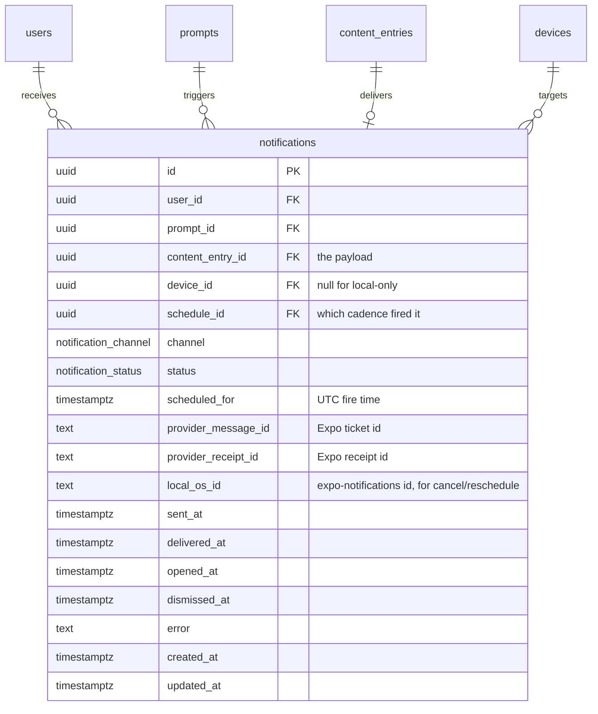
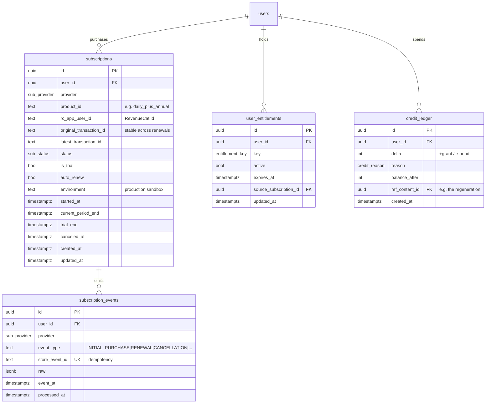
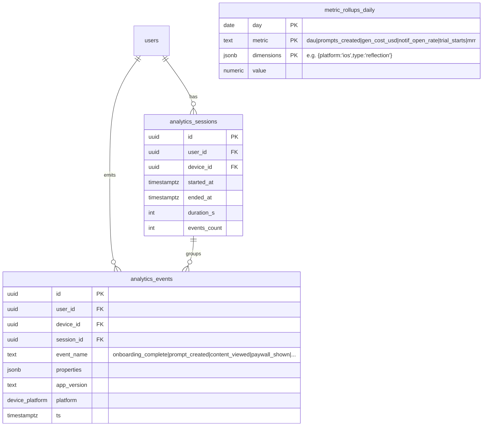
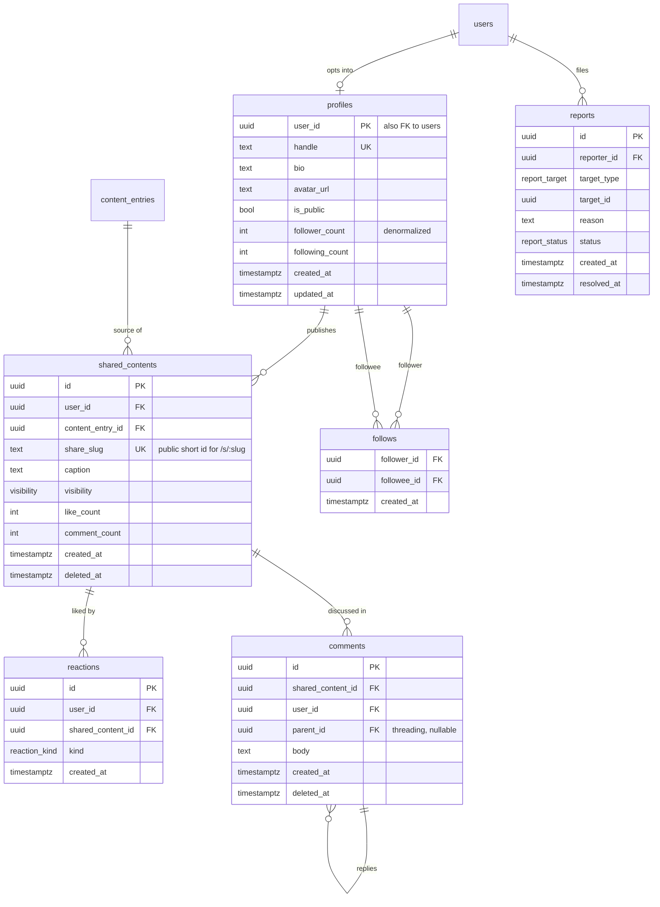

# Daily — Backend Database Schema & API Design

> Status: **design only** — no implementation code. Companion to `PLANNING.md`.
> Scope: the full **cloud** backend (Postgres + REST API) that Daily grows into once it
> has accounts, server-side generation, subscriptions, analytics, and social features.
> Author: backend architect pass, 2026-06-13.

---

## 0. Where this fits

`PLANNING.md §3.4` defines a **local-first MVP**: three tables (`daily_item`, `content_entry`,
`notification`) living in on-device `expo-sqlite`, with a stateless Express proxy that only
holds the Anthropic key. **That is still the right MVP** — ship it first.

This document designs the **server of record** that the app syncs to from Phase 4 onward. The
two are intentionally aligned: every local table maps to a cloud table with a `user_id` FK
added, so migration is "add the column, point sync at the API." Nothing here forces you to
build it early — it's the target the MVP is shaped to grow into.

### Design principles

| Principle | Decision |
|---|---|
| Database | **PostgreSQL 16+** (the SQLite schema ports cleanly; jsonb + partitioning + RLS earn their keep here). |
| Primary keys | **UUID v7** (`uuid` column, time-ordered) — index-friendly, no enumeration, sync-safe across devices. |
| Naming | `snake_case` tables/columns, plural table names, `*_id` FKs. |
| Timestamps | `created_at` / `updated_at` (`timestamptz`, UTC) on every table; `updated_at` drives sync conflict resolution. |
| Deletes | **Soft delete** (`deleted_at`) on user-content tables (prompts, content, shares, comments); hard delete only on join/ephemeral rows. |
| Money | Integer **cents** + ISO currency code — never floats. |
| Multi-tenancy | Every user-owned row carries `user_id`; enforce with Postgres **Row-Level Security**. |
| Anonymous-first | A `users` row exists from first launch (device-scoped, `is_anonymous = true`); Sign in with Apple *claims* it rather than creating a new one. |
| Time-zones | Store the user's **local** wall-clock time + IANA tz string; compute `next_run_at` in UTC. Never assume server tz. |
| Extensibility | Type-specific content fields go in a `jsonb` `structured` column, not new columns per content type. |

---

## 1. High-level domain map



The schema is presented as five ER diagrams (one per cluster) — a single 30-table diagram is
unreadable. Detailed DDL follows each.

---

## 2. Enumerated types

Centralize these as Postgres `ENUM`s (or `text` + `CHECK` if you prefer cheap additions —
enums require `ALTER TYPE ... ADD VALUE`). Recommended set:

```sql
content_type        : reflection | motivation | habit | story | journal | learning | custom
prompt_status       : active | paused | archived
schedule_frequency  : daily | weekdays | weekends | weekly | custom_days | multiple_daily
gen_status          : queued | running | ready | failed | refusal
notification_channel: local | push
notification_status : scheduled | sent | delivered | opened | dismissed | failed | canceled
auth_provider       : anonymous | apple | google | email
device_platform     : ios | android | web
sub_provider        : apple_app_store | google_play | revenuecat | stripe
sub_status          : trialing | active | grace_period | on_hold | paused | expired | canceled
entitlement_key     : daily_plus            -- extend as you add tiers
credit_reason       : daily_grant | purchase | regenerate_spend | refund | promo
visibility          : private | unlisted | followers | public
reaction_kind       : like | heart | spark
report_status       : open | reviewing | actioned | dismissed
report_target       : shared_content | comment | profile | prompt_template
```

---

## 3. Cluster 1 — Identity & Users



**Notes**
- **`users`** is created silently on first launch (anonymous). `handle` stays NULL until the
  user opts into social; it's the only globally-unique public name. Keep `display_name` private-ish.
- **Claiming**: Sign in with Apple posts the identity token; the backend attaches an
  `auth_identities` row to the *existing* anonymous user and flips `is_anonymous`, sets
  `claimed_at`. This preserves all the prompts/content the user already created offline.
- **`devices.install_id`** is the client's stable per-install UUID (SecureStore). One user can
  have many devices; push is targeted per device.
- **Auth tokens** are JWTs (access ~15 min + rotating refresh); store refresh-token *hashes* in
  a small `auth_sessions(id, user_id, device_id, refresh_hash, expires_at, revoked_at)` table
  if you want server-side revocation. Omitted from the diagram for brevity.

**Indexes**: `users(handle) UNIQUE WHERE handle IS NOT NULL`, `users(email) UNIQUE WHERE email IS NOT NULL`,
`auth_identities(provider, provider_subject) UNIQUE`, `devices(user_id)`, `devices(expo_push_token) WHERE push_enabled`.

---

## 4. Cluster 2 — Prompts, Templates & Schedules

> "Daily prompt" = the recurring *intent* the user created (PLANNING calls it `daily_item`).
> Renamed `prompts` here; "schedule" is split into its own table so one prompt can fire at
> multiple times/cadences (the post-MVP "multiple per day" feature).



**Notes**
- **`schedules.next_run_at`** is the heartbeat of the whole system: a worker queries
  `WHERE enabled AND next_run_at <= now()` to know what to generate/notify, then recomputes the
  next occurrence. Storing it precomputed in UTC keeps the hot path a single indexed range scan.
- **`days_of_week`** as a 7-bit mask (`0b1111100` = weekdays) is compact and indexable; an
  `int[]` is fine too if you prefer readability.
- **`prompt_templates`** serves both the curated starter library (`is_official = true`,
  `created_by = NULL`) *and* community-published prompts (Cluster 5) via the same table —
  `visibility` and `created_by` distinguish them. `usage_count` powers a "popular" list.
- `model_pref = 'auto'` lets the backend pick Haiku for free / Sonnet for Plus (PLANNING §4).

**Indexes**: `prompts(user_id, status) WHERE deleted_at IS NULL`, `prompts(template_id)`,
`schedules(prompt_id)`, **`schedules(next_run_at) WHERE enabled`** (the critical one),
`prompt_templates(slug) UNIQUE`, `prompt_templates(visibility, usage_count DESC)`.

---

## 5. Cluster 3 — Generated Content & Generation Jobs



**Notes**
- **`content_entries`** is the cloud twin of the MVP's local `content_entry`. Uniqueness is
  `(prompt_id, for_date, variant)` — `variant 0` is the day's canonical content; regenerations
  (a Plus feature) increment `variant` and set `regenerated_from`, so history is preserved and
  you can show "you regenerated this 2×."
- **`structured` jsonb** absorbs per-type shape (learning drip → `{phrase, translation, example}`;
  story → `{genre}`) without schema churn. The Claude structured-output (PLANNING §4.3) lands here.
- **Cost tracking** (`cost_micros`, tokens, model) lives on the row that incurred it → analytics
  and per-user unit economics come for free (no separate cost table needed).
- **`generation_jobs`** exists because cloud generation is **async** (a worker pre-generates
  today+tomorrow for everyone). `idempotency_key` guarantees a retried/duplicated request never
  double-charges Anthropic. The synchronous MVP `/generate` becomes "enqueue job + poll/stream."
- **Server-side prompt cache** (PLANNING §4.5): an optional `template_cache(type, intent_hash,
  for_date) -> content` lets many users sharing a starter template reuse one generation. Add only
  if cost demands it.

**Indexes**: `content_entries(prompt_id, for_date DESC)`, `content_entries(user_id, for_date DESC) WHERE deleted_at IS NULL`,
`content_entries(prompt_id, for_date, variant) UNIQUE`, `generation_jobs(status, created_at) WHERE status IN ('queued','running')`,
`generation_jobs(idempotency_key) UNIQUE`. **Partition `content_entries` by month** (`for_date`)
once it's large — it's append-heavy and time-queried.

---

## 6. Cluster 4 — Notification Tracking



**Notes**
- One table covers **both** delivery modes. MVP fires **local** notifications
  (`channel='local'`, `local_os_id` = the `expo-notifications` id used to cancel/reschedule on
  edit/pause/delete). The cloud version adds server **push** (`channel='push'`) via Expo's push
  service, tracking `provider_message_id` (ticket) → `provider_receipt_id` (receipt).
- **Engagement funnel** falls out of the timestamps: scheduled → sent → delivered → opened /
  dismissed. `opened_at` is your single most valuable retention signal; the app reports it via
  `POST /v1/notifications/:id/events` on deep-link open.
- **Reschedule semantics**: editing a prompt's time cancels future `scheduled` rows (status →
  `canceled`) and the scheduler creates fresh ones — never mutate a row that's already `sent`.

**Indexes**: `notifications(scheduled_for) WHERE status='scheduled'` (worker scan),
`notifications(user_id, created_at DESC)`, `notifications(provider_receipt_id) WHERE provider_receipt_id IS NOT NULL`.
**Partition by month** (`scheduled_for`) — highest-volume table after analytics.

---

## 7. Cluster 5 — Premium Subscriptions

> Source of truth is the **store** (App Store / Play). RevenueCat is the recommended aggregator
> (PLANNING §1 monetization). The DB **mirrors** entitlement state for fast gating and analytics;
> it never *decides* entitlement on its own.



**Notes**
- **`user_entitlements`** is the **gating cache** every request reads (`is daily_plus active?`).
  It's updated only by the webhook handler from `subscription_events` — a single
  `(user_id, key)` upsert. Reads are O(1); the app never has to call the store on the hot path.
- **`subscription_events`** is the append-only webhook log (RevenueCat events / App Store Server
  Notifications v2 / Play RTDN). `store_event_id UNIQUE` makes webhook delivery idempotent —
  stores retry aggressively. Replaying this log can rebuild `subscriptions` + `user_entitlements`.
- **`credit_ledger`** powers the free tier's metered actions: free users get N regenerations/day
  (`daily_grant`), each "give me another" spends one (`regenerate_spend`). Plus users bypass it.
  Append-only ledger > a mutable `balance` column (auditable, race-free). `balance_after` is a
  convenience snapshot.
- **`original_transaction_id`** is the join key that survives renewals/resubscribes — index it.

**Indexes**: `subscriptions(user_id)`, `subscriptions(original_transaction_id)`,
`user_entitlements(user_id, key) UNIQUE`, `subscription_events(store_event_id) UNIQUE`,
`credit_ledger(user_id, created_at DESC)`.

---

## 8. Cluster 6 — Analytics

> **Recommendation:** ship product analytics to **PostHog or Amplitude** (PLANNING §5 Phase 4),
> not your own Postgres — they give funnels/retention/cohorts out of the box and you avoid
> operating a high-write event store. Keep only a **thin first-party layer** in Postgres for
> things you must join to live data (cost dashboards, generation health, admin metrics).



**Notes**
- **`analytics_events`** is **partition-by-day, append-only**, and should have a short retention
  (e.g. 90 days) if you keep it at all — raw events belong in PostHog/warehouse long-term.
- **`metric_rollups_daily`** is what dashboards and the founder actually read: a nightly job
  aggregates raw events + joins live tables (cost from `content_entries`, MRR from
  `subscriptions`, open-rate from `notifications`) into one tidy table. Composite PK
  `(day, metric, dimensions)` makes it upsert-friendly and trivially queryable.
- **Generation + notification + subscription analytics need no new tables** — they're rollups
  over Clusters 3/4/5. That's the payoff of putting `cost_micros`, tokens, and the engagement
  timestamps on their source rows.

**Indexes**: `analytics_events(user_id, ts DESC)`, `analytics_events(event_name, ts DESC)`,
`analytics_sessions(user_id, started_at DESC)`. Partition `analytics_events` by day; drop old partitions.

---

## 9. Cluster 7 — Future Social Features

> Gated behind a public **profile** opt-in. The whole cluster is additive — none of it touches
> the core generation loop, and UGC pulls in moderation (`reports`) which the App Store will
> require before you ship sharing.



**Notes**
- **`profiles`** keeps social opt-in clean and separate from the always-present `users` row.
  `handle` is unique and lives here (mirrored from `users.handle` or moved here entirely).
- **Two sharing models, both supported:**
  1. **Share a card** → `shared_contents` wraps a `content_entry` with a public `share_slug`
     (great for "share-as-image," PLANNING nice-to-haves).
  2. **Publish a prompt** → reuse `prompt_templates` with `created_by = user` + `visibility =
     public` (Cluster 4). Others "subscribe" by creating a prompt `from-template`. No new table.
- **`follows`** is a composite-PK join (`PRIMARY KEY (follower_id, followee_id)`); counts are
  denormalized onto `profiles` and maintained by trigger/worker for cheap reads.
- **`reactions`** has a `UNIQUE (user_id, shared_content_id, kind)` — one like per user per post.
- **Feed**: start with **fan-out-on-read** (query followees' recent `shared_contents`) — simplest
  and fine to tens of thousands of users. Add a `feed_items` fan-out-on-write cache table only if
  read latency demands it. Don't build it speculatively.
- **`reports`** + a moderation queue is **non-negotiable** before enabling UGC (Apple Guideline
  1.2). `target_id` is polymorphic via `target_type`.

**Indexes**: `profiles(handle) UNIQUE`, `shared_contents(user_id, created_at DESC) WHERE deleted_at IS NULL`,
`shared_contents(share_slug) UNIQUE`, `follows(followee_id)` (for "my followers") + PK on
`(follower_id, followee_id)`, `reactions(user_id, shared_content_id, kind) UNIQUE`,
`comments(shared_content_id, created_at)`, `reports(status, created_at) WHERE status='open'`.

---

## 10. REST API design

**Conventions**
- Base path **`/v1`**; JSON in/out. Errors use one envelope:
  `{ "error": { "code": "string", "message": "human", "details": {...} } }`.
- **Auth**: `Authorization: Bearer <jwt>`. Anonymous users get a token too (from
  `/auth/anonymous`) — every endpoint requires *some* identity. Scopes widen after Apple claim.
- **Pagination**: cursor-based — `?limit=20&cursor=<opaque>` → `{ data, next_cursor }`.
- **Idempotency**: mutating + costly endpoints (generation, purchase sync) accept
  `Idempotency-Key` header.
- **Rate limiting**: per-user + per-IP (the forge `express-rate-limit` pattern), tighter on
  `/generate`. `429` with `Retry-After`.
- **Versioning**: additive within `/v1`; breaking → `/v2`.

### 10.1 Auth & account
| Method | Path | Purpose |
|---|---|---|
| `POST` | `/v1/auth/anonymous` | Bootstrap anonymous user + first device → `{ user, tokens }`. |
| `POST` | `/v1/auth/apple` | Verify Apple identity token; **claim** current anon user or sign in existing. |
| `POST` | `/v1/auth/google` | Same for Google (DuoBrain already has this flow). |
| `POST` | `/v1/auth/refresh` | Rotate refresh → new access token. |
| `POST` | `/v1/auth/logout` | Revoke the current refresh/session. |
| `GET`  | `/v1/me` | Current user + cached entitlements. |
| `PATCH`| `/v1/me` | Update `display_name`, `timezone`, `locale`. |
| `DELETE` | `/v1/me` | GDPR/Apple account deletion — soft-delete then purge job. |
| `GET`  | `/v1/me/export` | GDPR data export (async → download link). |

### 10.2 Devices & push
| Method | Path | Purpose |
|---|---|---|
| `POST` | `/v1/devices` | Register/upsert device by `install_id`. |
| `PATCH`| `/v1/devices/:id` | Update `expo_push_token`, `push_enabled`, app/os version. |
| `DELETE` | `/v1/devices/:id` | Deregister (logout/uninstall). |

### 10.3 Prompts & templates
| Method | Path | Purpose |
|---|---|---|
| `GET`  | `/v1/prompts` | List the user's prompts (`?status=active`). |
| `POST` | `/v1/prompts` | Create a prompt (free-tier limit enforced here → `402` if over). |
| `GET`  | `/v1/prompts/:id` | One prompt + its schedules + today's content. |
| `PATCH`| `/v1/prompts/:id` | Edit intent/type/title/tone/model_pref. |
| `DELETE` | `/v1/prompts/:id` | Soft-delete + cancel schedules/notifications. |
| `POST` | `/v1/prompts/:id/pause` · `/resume` | Toggle `status`, cancel/recreate schedules. |
| `POST` | `/v1/prompts/:id/reorder` | Update `position` for home sort. |
| `GET`  | `/v1/templates` | Starter + popular community templates (`?type=&sort=popular`). |
| `GET`  | `/v1/templates/:slug` | One template. |
| `POST` | `/v1/prompts/from-template/:slug` | Create a prompt seeded from a template. |

### 10.4 Schedules
| Method | Path | Purpose |
|---|---|---|
| `GET`  | `/v1/prompts/:id/schedules` | List schedules for a prompt. |
| `POST` | `/v1/prompts/:id/schedules` | Add a cadence (enables multiple-per-day). |
| `PATCH`| `/v1/schedules/:id` | Change time/frequency/days → recompute `next_run_at`. |
| `DELETE` | `/v1/schedules/:id` | Remove a cadence. |

### 10.5 Content & generation
| Method | Path | Purpose |
|---|---|---|
| `GET`  | `/v1/content/today` | All prompts' content for today (the **home** payload). |
| `GET`  | `/v1/prompts/:id/content` | History for a prompt (`?from=&to=`, paginated). |
| `GET`  | `/v1/content/:id` | One content entry (notification deep-link target). |
| `POST` | `/v1/prompts/:id/generate` | Enqueue generation for a date → `{ job }` (Idempotency-Key). |
| `POST` | `/v1/content/:id/regenerate` | "Give me another" — Plus, or spends a `credit_ledger` unit (`402` if none). |
| `GET`  | `/v1/jobs/:id` | Poll async generation status. |
| `DELETE` | `/v1/content/:id` | Hide/soft-delete a day's content. |

> This subsumes the MVP's stateless `POST /generate`: same Claude call (PLANNING §4) but now it
> **persists** the result, tracks cost/tokens, and runs async via a worker. The synchronous proxy
> stays valid for the local-first MVP; the cloud version layers jobs on top.

### 10.6 Notifications
| Method | Path | Purpose |
|---|---|---|
| `GET`  | `/v1/notifications` | Recent notifications for the user (history view). |
| `POST` | `/v1/notifications/events` | Batch client telemetry: `delivered`/`opened`/`dismissed`. |
| `POST` | `/v1/webhooks/expo-receipts` | (internal) Expo push receipts → update delivery status. |

### 10.7 Subscriptions & credits
| Method | Path | Purpose |
|---|---|---|
| `GET`  | `/v1/subscription` | Current subscription + entitlements (gating source for the app). |
| `POST` | `/v1/subscriptions/sync` | Client posts RevenueCat customer info / receipt → reconcile. |
| `GET`  | `/v1/credits` | Current regeneration-credit balance. |
| `POST` | `/v1/webhooks/revenuecat` | (S2S) RevenueCat events → `subscription_events` → entitlements. |
| `POST` | `/v1/webhooks/app-store` | (S2S) App Store Server Notifications v2. |
| `POST` | `/v1/webhooks/play-rtdn` | (S2S) Google Play Real-time Developer Notifications. |

### 10.8 Analytics
| Method | Path | Purpose |
|---|---|---|
| `POST` | `/v1/analytics/events` | Batch event ingest (or send straight to PostHog and skip this). |

### 10.9 Social (future)
| Method | Path | Purpose |
|---|---|---|
| `PATCH`| `/v1/me/profile` | Create/update public profile, claim `handle`, set `is_public`. |
| `GET`  | `/v1/profiles/:handle` | Public profile + recent shares. |
| `POST` | `/v1/content/:id/share` | Publish a card → `shared_contents` (`{ slug }`). |
| `GET`  | `/v1/s/:slug` | Public render of a shared card (also web/OG). |
| `DELETE` | `/v1/shares/:id` | Unshare. |
| `POST` | `/v1/prompts/:id/publish` | Publish a prompt as a public template. |
| `POST` · `DELETE` | `/v1/follows/:handle` | Follow / unfollow. |
| `GET`  | `/v1/me/feed` | Followees' recent shares (fan-out-on-read). |
| `POST` · `DELETE` | `/v1/shares/:id/like` | React / un-react. |
| `GET` · `POST` | `/v1/shares/:id/comments` | List / add comments. |
| `DELETE` | `/v1/comments/:id` | Delete own comment. |
| `POST` | `/v1/reports` | Report content/comment/profile (moderation). |

### 10.10 Ops
| Method | Path | Purpose |
|---|---|---|
| `GET`  | `/healthz` | Liveness + `{ db, anthropic, queue }` (extends forge's). |
| `GET`  | `/v1/admin/metrics` | Admin-only dashboards over `metric_rollups_daily`. |
| `GET`  | `/v1/admin/moderation` | Admin-only `reports` queue. |

---

## 11. Cross-cutting concerns

**Workers (not HTTP endpoints) that drive the system**
1. **Generation worker** — scans `schedules.next_run_at <= now()+lead`, enqueues
   `generation_jobs`, calls Anthropic, writes `content_entries` (pre-generates today + tomorrow).
2. **Notification worker** — for content that's ready, creates `notifications` and sends Expo
   push (cloud) at `scheduled_for`; polls receipts.
3. **Entitlement reconciler** — drains `subscription_events`, upserts `user_entitlements`.
4. **Rollup job** — nightly `metric_rollups_daily` aggregation.
5. **Retention/GDPR purger** — drops old analytics partitions; hard-deletes soft-deleted users
   past the grace window.

**Migration from the local-first MVP**
- Local SQLite (`daily_item`, `content_entry`, `notification`) → cloud tables 1:1 with `user_id`
  added. The anonymous `users` row already exists, so first cloud sync is: `POST /v1/devices`,
  then push local rows up (client carries `updated_at`; server resolves by last-write-wins per row).
- Keep the device as a **cache**: the app still works offline (SQLite), syncs opportunistically.

**Security & privacy** (extends PLANNING §3.8)
- **Postgres RLS**: every user-owned table gated by `user_id = current_setting('app.user_id')`.
- **`ANTHROPIC_API_KEY` stays server-only** — unchanged hard constraint.
- **PII minimization**: `intent` text is user content — encrypt at rest (Postgres TDE / disk
  encryption), never log raw intent, declare the Anthropic data flow in App Privacy labels.
- **Webhooks**: verify signatures (RevenueCat secret, Apple JWS, Expo) before trusting any event.
- **Account deletion** must cascade or anonymize across all clusters (Apple Guideline 5.1.1(v)).

**Scaling levers (in order you'd reach for them)**
1. Partition `analytics_events`, `notifications`, `content_entries` by time; drop old partitions.
2. Read replica for analytics/admin queries.
3. Move raw analytics to PostHog/warehouse; keep Postgres for transactional + rollups.
4. Cache `user_entitlements` and `/content/today` in Redis if read QPS demands it.
5. Feed fan-out-on-write (`feed_items`) only when fan-out-on-read gets slow.

---

## 12. Build order (so you don't over-build)

| Phase | Tables | Endpoints |
|---|---|---|
| **MVP (now)** | *local SQLite only* (PLANNING §3.4) | stateless `POST /generate`, `GET /healthz` |
| **P4a — Accounts + sync** | users, devices, auth_identities, prompts, schedules, content_entries | §10.1–10.5 |
| **P4b — Server gen + push** | generation_jobs, notifications | §10.5–10.6 + workers 1–2 |
| **P4c — Premium** | subscriptions, user_entitlements, subscription_events, credit_ledger | §10.7 + worker 3 |
| **P4d — Analytics** | analytics_*, metric_rollups_daily | §10.8 + worker 4 |
| **P5 — Social** | profiles, shared_contents, follows, reactions, comments, reports | §10.9 + moderation |

Each phase is independently shippable and maps directly onto a cluster above.
